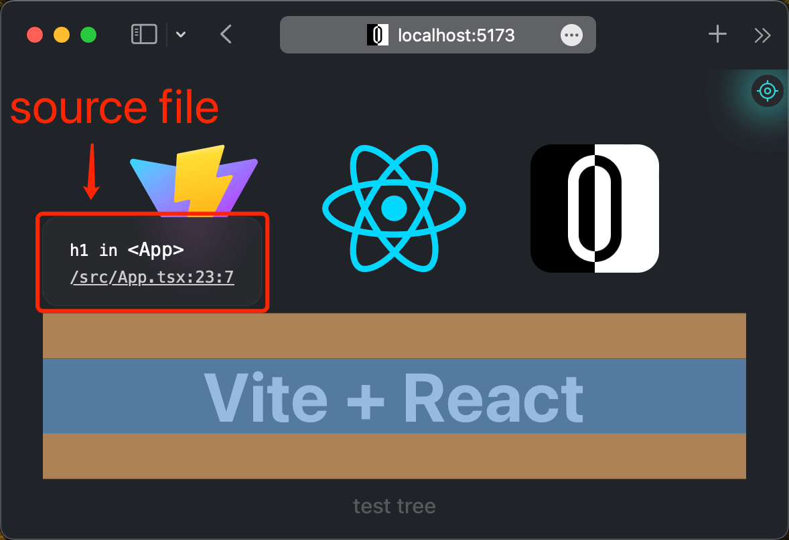

<p align="center">
  <a href="https://github.com/zjxxxxxxxxx/open-editor">
      
      <h1 align="center">Open Editor</h1>
  </a>
</p>
</br>
<p align="center">
  <a href="https://github.com/zjxxxxxxxxx/open-editor/actions/workflows/ci.yml">
    
  </a>
  
  </a>
</p>
<p align="center">
  <a href="./README.md">English</a> | <a href="./README.zh-CN.md">简体中文</a>
</p>
</br>

## 🔍 Project Overview

Open Editor is an intelligent debugging tool based on AST parsing technology, designed for modern web development. Through deep integration with build toolchains, it achieves bidirectional precise mapping between `browser elements ↔ source code`, allowing developers to directly locate source positions in React/Vue component trees and open corresponding files in local IDEs with one click. This revolutionary solution can save developers over 90%+ of source code locating time, significantly improving debugging efficiency.

[▶▶▶ Live Demo (Vite+React Example)](https://stackblitz.com/github/zjxxxxxxxxx/open-editor/tree/main/playgrounds/vite-react?embed=1&file=vite.config.ts&hideExplorer=1)  
[](https://stackblitz.com/github/zjxxxxxxxxx/open-editor/tree/main/playgrounds/vite-react?embed=1&file=vite.config.ts&hideExplorer=1)

## 🚀 Core Features

### Framework Support

- **React Ecosystem**: Deep adaptation for Create React App/Next.js etc.
- **Vue Ecosystem**: Deep adaptation for Vue CLI/Nuxt.js/Vite etc.
- **Build Tools**: Full compatibility with Webpack 4+/Vite 2+/Rollup 2+

### Debugging Capabilities

- Multi-level component tree tracing (supports cross-iframe communication)
- Shortcut-driven workflow (⌥⌘O to toggle inspector)
- Mobile remote debugging support
- Intelligent IDE detection (auto-recognizes locally installed editors)

### Environment Requirements

- **Exclusive Mode**: Development environment only
- **Runtime Requirements**:
  - Node.js 14+
  - Modern browsers (latest stable version of any):
    - Google Chrome ≥ 89 (Mar 2021)
    - Mozilla Firefox ≥ 85 (Jan 2021)
    - Microsoft Edge ≥ 90 (Apr 2021)
    - Apple Safari ≥ 14 (Sep 2020)
- **Security Protocol**: Requires TLS 1.2/1.3

## 🛠️ Quick Start

### Prerequisites

#### React Projects

```bash
# Verify Babel plugin configuration
npm list @babel/plugin-transform-react-jsx-source
```

> Ensure this plugin is enabled if using custom Babel config

#### Vue Projects

```bash
# Install required dependency
npm install unplugin-vue-source -D
```

> Required for accurate line/column positioning

### Integration Example

> Demonstrated with `Vite+React` ([source](https://github.com/zjxxxxxxxxx/open-editor/tree/main/playgrounds/vite-react)). Configuration varies by tech stack, but core logic remains consistent.

#### Tool Integration

##### 1. Install Plugin

```bash
npm i @open-editor/vite -D
```

##### 2. Add Configuration

```ts
// vite.config.ts
import { defineConfig } from 'vite';
import react from '@vitejs/plugin-react';
import OpenEditor from '@open-editor/vite';

export default defineConfig({
  plugins: [
    react(),
    OpenEditor({
      // options
    }),
  ],
});
```

##### 3. Start Dev Server

```bash
npm run dev
```

#### Debugging Workflow

##### 1. Activate Inspector

- **Shortcut**: ⌥⌘O (Mac) | Alt+Ctrl+O (Win)
- **Mouse**: Click browser toolbar toggle

  ###### Toggle Button Demo

  

##### 2. Element Inspection

- **Hover Preview**: Display source location on hover
- **Precise Navigation**:

  - Click to open in editor (with line/column)
  - Long-press (or ⌘+click) to view component tree

  ###### Hover Preview Demo

  

  ###### Component Tree Demo

  

##### 3. Exit Inspector

- **Shortcut**: Esc or re-trigger ⌥⌘O/Alt+Ctrl+O
- **Mouse**: Click toggle button or right-click

## ⚙️ Advanced Features

### Global Events

```ts
// Custom inspector activation
window.addEventListener('enableinspector', (e) => {
  e.preventDefault(); // Block default behavior
});

// Custom inspector exit
window.addEventListener('exitinspector', (e) => {
  e.preventDefault(); // Block default behavior
});

// Custom editor launch
window.addEventListener('openeditor', (e) => {
  const url = new URL(e.detail);
  url.hostname = 'localhost'; // Modify domain
  window.open(url.toString());
  e.preventDefault(); // Block default behavior
});
```

## 🖼 Ecosystem

### Official Plugins

| Documentation                                                                                   | NPM Version                                                                                                                    | Downloads                                                                                                                    |
| ----------------------------------------------------------------------------------------------- | ------------------------------------------------------------------------------------------------------------------------------ | ---------------------------------------------------------------------------------------------------------------------------- |
| [`@open-editor/rollup`](https://github.com/zjxxxxxxxxx/open-editor/tree/main/packages/rollup)   | [](https://www.npmjs.com/package/@open-editor/rollup)   | [](https://www.npmjs.com/package/@open-editor/rollup)   |
| [`@open-editor/vite`](https://github.com/zjxxxxxxxxx/open-editor/tree/main/packages/vite)       | [](https://www.npmjs.com/package/@open-editor/vite)       | [](https://www.npmjs.com/package/@open-editor/vite)       |
| [`@open-editor/webpack`](https://github.com/zjxxxxxxxxx/open-editor/tree/main/packages/webpack) | [](https://www.npmjs.com/package/@open-editor/webpack) | [](https://www.npmjs.com/package/@open-editor/webpack) |

### Online Playgrounds

| Source Code                                                                                         | Live Demo                                                                                                                                                                        |
| --------------------------------------------------------------------------------------------------- | -------------------------------------------------------------------------------------------------------------------------------------------------------------------------------- |
| [`rollup/react15`](https://github.com/zjxxxxxxxxx/open-editor/tree/main/playgrounds/rollup-react15) | [](https://stackblitz.com/github/zjxxxxxxxxx/open-editor/tree/main/playgrounds/rollup-react15) |
| [`rollup/vue2`](https://github.com/zjxxxxxxxxx/open-editor/tree/main/playgrounds/rollup-vue2)       | [](https://stackblitz.com/github/zjxxxxxxxxx/open-editor/tree/main/playgrounds/rollup-vue2)    |
| [`vite/react`](https://github.com/zjxxxxxxxxx/open-editor/tree/main/playgrounds/vite-react)         | [](https://stackblitz.com/github/zjxxxxxxxxx/open-editor/tree/main/playgrounds/vite-react)     |
| [`vite/vue`](https://github.com/zjxxxxxxxxx/open-editor/tree/main/playgrounds/vite-vue)             | [](https://stackblitz.com/github/zjxxxxxxxxx/open-editor/tree/main/playgrounds/vite-vue)       |
| [`vite/nuxt`](https://github.com/zjxxxxxxxxx/open-editor/tree/main/playgrounds/vite-nuxt)           | [](https://stackblitz.com/github/zjxxxxxxxxx/open-editor/tree/main/playgrounds/vite-nuxt)      |
| [`webpack/react`](https://github.com/zjxxxxxxxxx/open-editor/tree/main/playgrounds/webpack-react)   | [](https://stackblitz.com/github/zjxxxxxxxxx/open-editor/tree/main/playgrounds/webpack-react)  |
| [`webpack/nextjs`](https://github.com/zjxxxxxxxxx/open-editor/tree/main/playgrounds/webpack-nextjs) | [](https://stackblitz.com/github/zjxxxxxxxxx/open-editor/tree/main/playgrounds/webpack-nextjs) |
| [`webpack/vue`](https://github.com/zjxxxxxxxxx/open-editor/tree/main/playgrounds/webpack-vue)       | [](https://stackblitz.com/github/zjxxxxxxxxx/open-editor/tree/main/playgrounds/webpack-vue)    |

## Acknowledgments

- [react-dev-inspector](https://github.com/zthxxx/react-dev-inspector)
- [vite-plugin-vue-inspector](https://github.com/webfansplz/vite-plugin-vue-inspector)
- [launch-editor](https://github.com/yyx990803/launch-editor)
