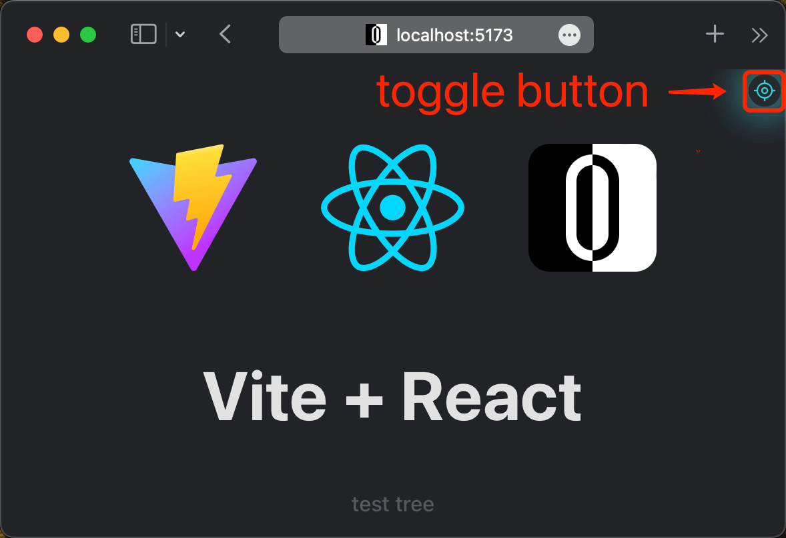

<p align="center">
  <a href="https://github.com/zjxxxxxxxxx/open-editor">
      
      <h1 align="center">Open Editor</h1>
  </a>
</p>
</br>
<p align="center">
  <a href="https://github.com/zjxxxxxxxxx/open-editor/actions/workflows/ci.yml">
    
  </a>
  
  </a>
</p>
<p align="center">
  <a href="./README.md">English</a> | <a href="./README.zh-CN.md">简体中文</a>
</p>
</br>

A web devtools for fast find source code.

Whether you are a `React` developer, a `Vue` developer, or a `React` and `Vue` developer, this development tool can help you. It can save you a lot of time looking for code, allowing you to focus more on writing code. Whether in `React` or `Vue`, it can achieve exactly the same effect.


> Valid only during development, requires Node.js version 14+.

## Features

- 🌈 Support `React`、`Nextjs`、`Vue`、`Nuxt`。
- 🔥 Support `Rollup`、`Vite`、`Webpack`。
- 🕹️ Support combined shortcut keys.
- 🎯 Support precise positioning of line and column.
- 🚀 Support find component tree.
- 📱 Support mobile devices.
- 👽 Automatically opens available editors.

## Usage

### React

> Requires React version 15+.

`open-editor` needs to be used with [`@babel/plugin-transform-react-jsx-source`](https://babeljs.io/docs/babel-plugin-transform-react-jsx-source), which is a plugin for getting source code line and column information. Usually you don't have to pay attention to this thing because it is mainly built into the scaffolding tool. If you encounter the problem that `open-editor` cannot open the code editor, this will It will be a way to troubleshoot the problem.

### Vue

> Requires Vue version 2+.

`open-editor` needs to be used with [`unplugin-vue-source`](https://github.com/zjxxxxxxxxx/unplugin-vue-source), which is a plugin for getting source code line and column information , if this plugin is missing, the source code file will only be opened in the code editor, but line and column cannot be located.

### Use plugin

> The example uses [`vite/react`](https://github.com/zjxxxxxxxxx/open-editor/tree/main/playground/vite-react) as a reference. In other cases, the only choice is different, and the usage is exactly the same.

First you need to install the plugin into the project.

```bash
npm i @open-editor/vite -D
```

Then add the plugin to the build configuration.

```ts
// vite.config.ts
import { defineConfig } from 'vite';
import react from '@vitejs/plugin-react';
import OpenEditor from '@open-editor/vite';

export default defineConfig({
  plugins: [
    react({
      babel: {
        retainLines: true,
      },
    }),
    OpenEditor({
      // options
    }),
  ],
});
```

### Enable inspector

First you need to get the project running.

```bash
npm run dev
```

At this time, open the local server address of the project in the browser, and you will see a toggle button appearing in the upper right corner of the browser. This toggle button can be used to toggle the enabled status of the inspector.

> If you think that the switch button blocks your user interface, you can long press the switch button, wait for the switch button to enter the draggable state, and then adjust the display position of the switch button by dragging it.


Enable the inspector by clicking (shortcut: ⌨️ <kbd>option ⌥</kbd> + <kbd>command ⌘</kbd> + <kbd>O</kbd>) the toggle button in the upper right corner of your browser, then, We can see the source code location information by moving the mouse over the element that needs to be inspected.


At this point, click on the element to automatically open the source code file in the code editor and locate the line and column.


At this time, you can also choose to long press (shortcut key: ⌨️ <kbd>command ⌘</kbd> + 🖱 click) element to view the complete component tree.


Then click on the tree node to automatically open the source code file in the code editor and locate the line and column.


### Exit inspector

Click again (shortcut key 1: ⌨️ <kbd>option ⌥</kbd> + <kbd>command ⌘</kbd> + <kbd>O</kbd>, shortcut key 2: ⌨️ <kbd>esc</kbd>, shortcut key 3: 🖱 right-click) the switch button in the upper right corner of the browser to exit the inspector.



## `enableinspector` event

The default behavior of enable inspector can be changed by subscribing to the `enableinspector` event.

### Prevent default behavior

```ts
window.addEventListener('enableinspector', (e) => {
  e.preventDefault();
});
```

### Add additional handler

```ts
window.addEventListener('enableinspector', (e) => {
  console.log('enable inspector');
});
```

## `exitinspector` event

The default behavior of exit inspector can be changed by subscribing to the `exitinspector` event.

### Prevent default behavior

```ts
window.addEventListener('exitinspector', (e) => {
  e.preventDefault();
});
```

### Add additional handler

```ts
window.addEventListener('exitinspector', (e) => {
  console.log('exit inspector');
});
```

## `openeditor` event

The default behavior of opening an editor can be changed by subscribing to the `openeditor` event.

### Prevent default behavior

```ts
window.addEventListener('openeditor', (e) => {
  e.preventDefault();
});
```

### Redirect `URL`

```ts
window.addEventListener('openeditor', (e) => {
  (e as CustomEvent<URL>).detail.hostname = '127.0.0.1';
});
```

## Packages

| Source code                                                                                     | NPM version                                                                                                                    | Downloads                                                                                                                    |
| ----------------------------------------------------------------------------------------------- | ------------------------------------------------------------------------------------------------------------------------------ | ---------------------------------------------------------------------------------------------------------------------------- |
| [`@open-editor/rollup`](https://github.com/zjxxxxxxxxx/open-editor/tree/main/packages/rollup)   | [](https://www.npmjs.com/package/@open-editor/rollup)   | [](https://www.npmjs.com/package/@open-editor/rollup)   |
| [`@open-editor/vite`](https://github.com/zjxxxxxxxxx/open-editor/tree/main/packages/vite)       | [](https://www.npmjs.com/package/@open-editor/vite)       | [](https://www.npmjs.com/package/@open-editor/vite)       |
| [`@open-editor/webpack`](https://github.com/zjxxxxxxxxx/open-editor/tree/main/packages/webpack) | [](https://www.npmjs.com/package/@open-editor/webpack) | [](https://www.npmjs.com/package/@open-editor/webpack) |

## Playgrounds

| Source code                                                                                        | Online trial                                                                                            |
| -------------------------------------------------------------------------------------------------- | ------------------------------------------------------------------------------------------------------- |
| [`rollup/react15`](https://github.com/zjxxxxxxxxx/open-editor/tree/main/playground/rollup-react15) | [StackBlitz](https://stackblitz.com/github/zjxxxxxxxxx/open-editor/tree/main/playground/rollup-react15) |
| [`rollup/vue2`](https://github.com/zjxxxxxxxxx/open-editor/tree/main/playground/rollup-vue2)       | [StackBlitz](https://stackblitz.com/github/zjxxxxxxxxx/open-editor/tree/main/playground/rollup-vue2)    |
| [`vite/react`](https://github.com/zjxxxxxxxxx/open-editor/tree/main/playground/vite-react)         | [StackBlitz](https://stackblitz.com/github/zjxxxxxxxxx/open-editor/tree/main/playground/vite-react)     |
| [`vite/vue`](https://github.com/zjxxxxxxxxx/open-editor/tree/main/playground/vite-vue)             | [StackBlitz](https://stackblitz.com/github/zjxxxxxxxxx/open-editor/tree/main/playground/vite-vue)       |
| [`webpack/react`](https://github.com/zjxxxxxxxxx/open-editor/tree/main/playground/webpack-react)   | [StackBlitz](https://stackblitz.com/github/zjxxxxxxxxx/open-editor/tree/main/playground/webpack-react)  |
| [`webpack/nextjs`](https://github.com/zjxxxxxxxxx/open-editor/tree/main/playground/webpack-nextjs) | [StackBlitz](https://stackblitz.com/github/zjxxxxxxxxx/open-editor/tree/main/playground/webpack-nextjs) |
| [`webpack/vue`](https://github.com/zjxxxxxxxxx/open-editor/tree/main/playground/webpack-vue)       | [StackBlitz](https://stackblitz.com/github/zjxxxxxxxxx/open-editor/tree/main/playground/webpack-vue)    |
| [`webpack/nuxt`](https://github.com/zjxxxxxxxxx/open-editor/tree/main/playground/webpack-nuxt)     | [StackBlitz](https://stackblitz.com/github/zjxxxxxxxxx/open-editor/tree/main/playground/webpack-nuxt)   |

## Thanks

- [react-dev-inspector](https://github.com/zthxxx/react-dev-inspector)
- [vite-plugin-vue-inspector](https://github.com/webfansplz/vite-plugin-vue-inspector)
- [launch-editor](https://github.com/yyx990803/launch-editor)
