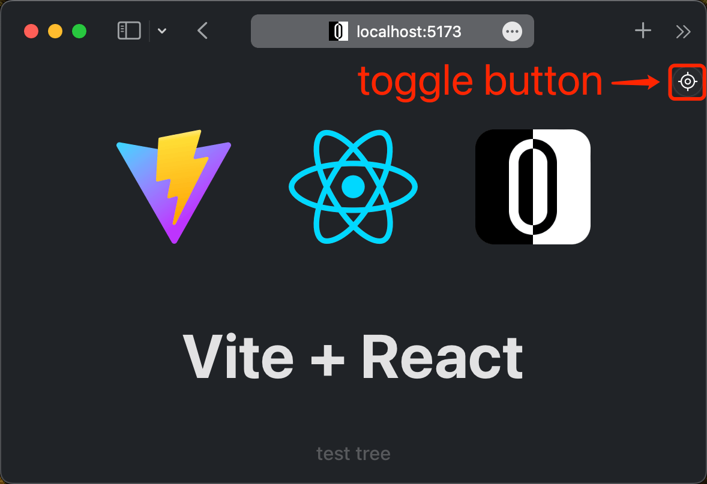

<p align="center">
  <a href="https://github.com/zjxxxxxxxxx/open-editor">
      
      <h1 align="center">Open Editor</h1>
  </a>
</p>
</br>
<p align="center">
  <a href="https://github.com/zjxxxxxxxxx/open-editor/actions/workflows/ci.yml">
    
  </a>
  
  </a>
</p>
<p align="center">
  <a href="./README.md">English</a> | <a href="./README.zh-CN.md">简体中文</a>
</p>
</br>

🚀🚀🚀 一个用于快速查找源代码的 web 开发调试工具。

不论您是一个`React`开发者， 还是一个`Vue`开发者，又或者是一个`React`、`Vue`双料开发者，这款开发工具都可以帮助到您。它能够帮您省去大量查找代码的时间，使您能够更加专心的编写代码。无论在`React`还是`Vue`中，它都能够达到完全相同的效果。

[↓↓↓ 点击这里打开 StackBlitz](https://stackblitz.com/github/zjxxxxxxxxx/open-editor/tree/main/playground/vite-react?embed=1&file=vite.config.ts&hideExplorer=1)
[](https://stackblitz.com/github/zjxxxxxxxxx/open-editor/tree/main/playground/vite-react?embed=1&file=vite.config.ts&hideExplorer=1)

> 仅在 development 生效，需要 Node.js 版本 14+。

## 功能

- 🌈 支持 `React`、`Nextjs`、`Vue`、`Nuxt`。
- 🔥 支持 `Rollup`、`Vite`、`Webpack`。
- 🎢 支持跨 iframe 交互。
- 🕹️ 支持组合式快捷键。
- 🎯 支持精准定位行和列。
- 🚀 支持查找组件树。
- 📱 支持移动设备。
- 👽 自动打开可用编辑器。

## 使用

### React

> 需要 React 版本 15+。

`OpenEditor`需要与[`@babel/plugin-transform-react-jsx-source`](https://babeljs.io/docs/babel-plugin-transform-react-jsx-source)一起使用，它是一个用于获取源代码行和列信息的插件，通常你不必关注这件事情，因为它主要内置在脚手架工具中，如果您遇到`OpenEditor`无法打开代码编辑器的问题，这将会是一个排查问题的方式。

### Vue

> 需要 Vue 版本 2+。

`OpenEditor`需要与[`unplugin-vue-source`](https://github.com/zjxxxxxxxxx/unplugin-vue-source)一起使用，它是一个用于获取源代码行和列信息的插件，如果缺少这个插件，将只会在代码编辑器中打开源代码文件，而无法定位到行和列。

### 使用插件

> 示例以 [`vite/react`](https://github.com/zjxxxxxxxxx/open-editor/tree/main/playgrounds/vite-react) 作为参考，其他情况下只是选择不同而已，使用方式是完全一致的。

首先需要将插件安装到项目中。

```bash
npm i @open-editor/vite -D
```

然后将插件添加到编译配置中。

```ts
// vite.config.ts
import { defineConfig } from 'vite';
import react from '@vitejs/plugin-react';
import OpenEditor from '@open-editor/vite';

export default defineConfig({
  plugins: [
    react(),
    OpenEditor({
      // options
    }),
  ],
});
```

### 启用检查器

首先需要让项目运行起来。

```bash
npm run dev
```

此时在浏览器中打开项目的本地服务器地址，您会看见浏览器的右上角出现了一个切换按钮，这个切换按钮可以用于切换检查器的启用状态。

> 如果您认为切换按钮遮挡住了您的用户界面，您可以长按切换按钮，等待切换按钮进入可拖拽状态后，以拖拽的方式调整切换按钮的显示位置



点击（快捷键：⌨️ <kbd>option ⌥</kbd> + <kbd>command ⌘</kbd> + <kbd>O</kbd>）浏览器右上角的切换按钮即可启用检查器，然后，我们移动鼠标到需要检查的元素上即可看见源代码位置信息。


此时点击（快捷键：⌨️ <kbd>enter</kbd> ）元素即可自动在代码编辑器中打开源代码文件，并定位到行和列。


此时也可以选择长按（快捷键1：⌨️ <kbd>backspace</kbd>，快捷键2：⌨️ <kbd>command ⌘</kbd> + 🖱 click）元素查看完整组件树。


然后点击树节点即可自动在代码编辑器中打开源代码文件，并定位到行和列。


### 退出检查器

再次点击（快捷键1：⌨️ <kbd>option ⌥</kbd> + <kbd>command ⌘</kbd> + <kbd>O</kbd>，快捷键2：⌨️ <kbd>esc</kbd>，快捷键3：🖱 right-click）浏览器右上角的切换按钮即可退出检查器。


## `enableinspector` 事件

可以通过订阅 `enableinspector` 事件改变启用检查器的默认行为。

### 阻止默认行为

```ts
window.addEventListener('enableinspector', (e) => {
  e.preventDefault();
});
```

### 添加额外的处理程序

```ts
window.addEventListener('enableinspector', (e) => {
  console.log('enable inspector');
});
```

## `exitinspector` 事件

可以通过订阅 `exitinspector` 事件改变退出检查器的默认行为。

### 阻止默认行为

```ts
window.addEventListener('exitinspector', (e) => {
  e.preventDefault();
});
```

### 添加额外的处理程序

```ts
window.addEventListener('exitinspector', (e) => {
  console.log('exit inspector');
});
```

## `openeditor` 事件

可以通过订阅 `openeditor` 事件改变打开编辑器的默认行为。

### 阻止默认行为

```ts
window.addEventListener('openeditor', (e) => {
  e.preventDefault();
});
```

### 重定向 `URL`

```ts
window.addEventListener('openeditor', (e) => {
  (e as CustomEvent<URL>).detail.hostname = '127.0.0.1';
});
```

## 安装包

| 源代码                                                                                          | NPM 版本                                                                                                                       | 下载量                                                                                                                       |
| ----------------------------------------------------------------------------------------------- | ------------------------------------------------------------------------------------------------------------------------------ | ---------------------------------------------------------------------------------------------------------------------------- |
| [`@open-editor/rollup`](https://github.com/zjxxxxxxxxx/open-editor/tree/main/packages/rollup)   | [](https://www.npmjs.com/package/@open-editor/rollup)   | [](https://www.npmjs.com/package/@open-editor/rollup)   |
| [`@open-editor/vite`](https://github.com/zjxxxxxxxxx/open-editor/tree/main/packages/vite)       | [](https://www.npmjs.com/package/@open-editor/vite)       | [](https://www.npmjs.com/package/@open-editor/vite)       |
| [`@open-editor/webpack`](https://github.com/zjxxxxxxxxx/open-editor/tree/main/packages/webpack) | [](https://www.npmjs.com/package/@open-editor/webpack) | [](https://www.npmjs.com/package/@open-editor/webpack) |

## 演练场

| 源代码                                                                                              | 在线试玩                                                                                                                                                                        |
| --------------------------------------------------------------------------------------------------- | ------------------------------------------------------------------------------------------------------------------------------------------------------------------------------- |
| [`rollup/react15`](https://github.com/zjxxxxxxxxx/open-editor/tree/main/playgrounds/rollup-react15) | [](https://stackblitz.com/github/zjxxxxxxxxx/open-editor/tree/main/playground/rollup-react15) |
| [`rollup/vue2`](https://github.com/zjxxxxxxxxx/open-editor/tree/main/playgrounds/rollup-vue2)       | [](https://stackblitz.com/github/zjxxxxxxxxx/open-editor/tree/main/playground/rollup-vue2)    |
| [`vite/react`](https://github.com/zjxxxxxxxxx/open-editor/tree/main/playgrounds/vite-react)         | [](https://stackblitz.com/github/zjxxxxxxxxx/open-editor/tree/main/playground/vite-react)     |
| [`vite/vue`](https://github.com/zjxxxxxxxxx/open-editor/tree/main/playgrounds/vite-vue)             | [](https://stackblitz.com/github/zjxxxxxxxxx/open-editor/tree/main/playground/vite-vue)       |
| [`vite/nuxt`](https://github.com/zjxxxxxxxxx/open-editor/tree/main/playgrounds/vite-nuxt)           | [](https://stackblitz.com/github/zjxxxxxxxxx/open-editor/tree/main/playground/vite-nuxt)      |
| [`webpack/react`](https://github.com/zjxxxxxxxxx/open-editor/tree/main/playgrounds/webpack-react)   | [](https://stackblitz.com/github/zjxxxxxxxxx/open-editor/tree/main/playground/webpack-react)  |
| [`webpack/nextjs`](https://github.com/zjxxxxxxxxx/open-editor/tree/main/playgrounds/webpack-nextjs) | [](https://stackblitz.com/github/zjxxxxxxxxx/open-editor/tree/main/playground/webpack-nextjs) |
| [`webpack/vue`](https://github.com/zjxxxxxxxxx/open-editor/tree/main/playgrounds/webpack-vue)       | [](https://stackblitz.com/github/zjxxxxxxxxx/open-editor/tree/main/playground/webpack-vue)    |

## 致谢

- [react-dev-inspector](https://github.com/zthxxx/react-dev-inspector)
- [vite-plugin-vue-inspector](https://github.com/webfansplz/vite-plugin-vue-inspector)
- [launch-editor](https://github.com/yyx990803/launch-editor)
